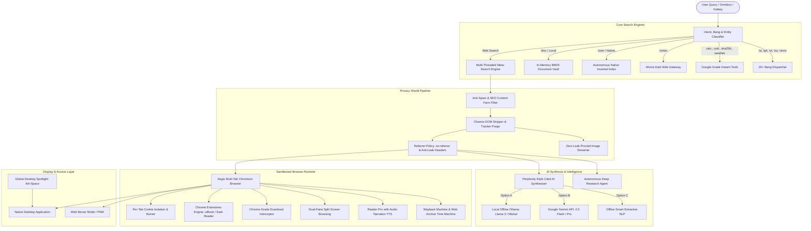

<div align="center">

# 🛡️ AEGIS ULTIMATE
### Sovereign Zero-Telemetry Private Search Engine & Chromium Desktop Browser Suite

*Sub-5ms BM25 Local Indexing • Isolated Multi-Tab Proxy Browser • Perplexity-Style Cited AI • Autonomous Web Crawler • Google Parity Instant Tools • Dark Web Gateway*

**Engineered by [Zeeshan Saeed](https://github.com/zeeshansaeed6)**

<br/>

[](https://github.com/zeeshansaeed6/Aegis-Ultimate/stargazers)
[](https://github.com/zeeshansaeed6/Aegis-Ultimate/network)
[](https://github.com/zeeshansaeed6)
[](LICENSE)
<br/>
[](https://nodejs.org)
[](https://electronjs.org)
[](#-zero-telemetry-privacy-guarantees)
[-emerald.svg?style=for-the-badge)](#-automated-test-suite--quality-assurance)

<br/>

[Quick Start](#-quick-start-1-click-launchers) • [Aegis vs. Google](#-aegis-vs-google--conventional-browsers) • [System Architecture](#-system-architecture) • [8 Flagship Pillars](#-the-8-flagship-pillars-of-aegis) • [Keyboard Shortcuts](#-complete-keyboard-shortcuts-cheatsheet) • [Bangs & Tools](#-instant-answers--bang-shortcuts-cheat-sheet) • [API Reference](#-rest-api-reference)

---

</div>

## 📑 Table of Contents
- [👨‍💻 Created & Engineered by Zeeshan Saeed](#-created--engineered-by-zeeshan-saeed)
- [⚡ Aegis vs. Google & Conventional Browsers](#-aegis-vs-google--conventional-browsers)
- [🏛️ System Architecture](#-system-architecture)
- [🚀 Quick Start (1-Click Launchers)](#-quick-start-1-click-launchers)
- [🌟 The 8 Flagship Pillars of Aegis](#-the-8-flagship-pillars-of-aegis)
  - [Pillar 1: Standalone Desktop Browser (Electron & Chromium)](#1-standalone-desktop-browser-electron--chromium)
  - [Pillar 2: Autonomous Native Search Engine & Crawler Studio](#2-autonomous-native-search-engine--web-crawler-studio)
  - [Pillar 3: Multi-Engine Meta-Search Aggregator & Focus Lenses](#3-multi-engine-meta-search-aggregator--focus-lenses)
  - [Pillar 4: In-Memory BM25 Document Vault & Local Folder Watcher](#4-in-memory-bm25-document-vault--local-folder-watcher)
  - [Pillar 5: Perplexity-Style Cited AI Synthesis & Deep Research](#5-perplexity-style-cited-ai-synthesis--deep-research-agent)
  - [Pillar 6: Google Search Parity (15+ Zero-Latency Instant Tools)](#6-google-search-parity--15-instant-tools--knowledge-graph)
  - [Pillar 7: Privacy Shield, Anonymous Proxy & Web Time Machine](#7-privacy-shield-anonymous-proxy--web-time-machine)
  - [Pillar 8: Global Desktop Spotlight & Universal Command Palette](#8-global-desktop-spotlight--universal-command-palette)
- [⌨️ Complete Keyboard Shortcuts Cheatsheet](#-complete-keyboard-shortcuts-cheatsheet)
- [🛠️ Instant Answers & Bang Shortcuts Cheat Sheet](#-instant-answers--bang-shortcuts-cheat-sheet)
- [🤖 AI Synthesis & Deep Research Configuration](#-ai-synthesis--deep-research-configuration)
- [🧪 Automated Test Suite & Quality Assurance](#-automated-test-suite--quality-assurance)
- [🔒 Zero-Telemetry Privacy Guarantees & Threat Model](#-zero-telemetry-privacy-guarantees--threat-model)
- [💻 Installation & Developer Setup Guide](#-installation--developer-setup-guide)
- [🐳 Self-Hosting & Headless Server Deployment](#-self-hosting--headless-server-deployment)
- [📡 REST API Reference](#-rest-api-reference)
- [📂 Project Directory Layout](#-project-directory-layout)
- [❓ Frequently Asked Questions (FAQ)](#-frequently-asked-questions-faq)
- [🤝 Contributing & License](#-contributing--license)

---

## 👨‍💻 Created & Engineered by Zeeshan Saeed

**Aegis Ultimate** was architected and built from scratch by **Zeeshan Saeed** as an open-source, user-sovereign replacement for the surveillance-driven search engine and browser ecosystem.

Modern search engines record every query you enter, tie your search terms to your IP address and personal account, build commercial behavioral dossiers, and auction your intent to ad networks. At the same time, mainstream browsers harvest browsing telemetry, sync navigation histories to centralized clouds, and facilitate pervasive canvas fingerprinting.

**Aegis dismantles this paradigm.** By combining a 100% volatile in-memory architecture, an isolated Chromium multi-tab browser, local BM25 indexing, and multi-source meta-search aggregation, Aegis guarantees:
- **Zero search history or IP logs written to disk.**
- **Zero tracking pixels or third-party surveillance scripts executed.**
- **Zero sponsored ads or SEO affiliate link farms in search results.**
- **Sub-5ms deterministic keyword search over your own documents.**
- **Sovereign, offline AI synthesis with verifiable bracket citations.**

---

## ⚡ Aegis vs. Google & Conventional Browsers

| Feature / Dimension | Google Search & Google Chrome | DuckDuckGo / Brave | Aegis Ultimate (by Zeeshan Saeed) |
| :--- | :--- | :--- | :--- |
| **Search Query Retention** | Permanent query history tied to Google Account & IP. | Ephemeral queries, but syndicated upstream results. | **100% Volatile RAM Only**: Zero database, zero disk logging. |
| **Browser Runtime** | Chrome monitors user telemetry, clicks, and tab states. | Brave/Brave Shields, but standard browser engine. | **Isolated Sandboxed Browser**: In-app Chromium tabs with automatic cookie/tracker stripping and 1-click session burn. |
| **Search Results Quality** | Dominated by sponsored ads, paid bids, and SEO farms. | Displays sponsored ads and affiliate links. | **Pure Organic Search**: Zero ads, zero sponsored placements, multi-engine deduplicated aggregation. |
| **AI Synthesis** | Monetized Gemini AI connected to personal profiles. | Cloud-hosted DuckAssist / Leo AI on corporate servers. | **Perplexity-Style Cited AI**: Grounded bracket citations `[1]`, `[2]` via local Ollama, Gemini API, or offline NLP. |
| **Autonomous Deep Research** | Requires paid Gemini Advanced / Perplexity Pro subscription. | Not available or paywalled. | **Built-in Deep Research Agent**: Decomposes topics into 4 concurrent research angles and outputs publication dossiers. |
| **Native Web Crawler** | Proprietary Googlebot crawler with closed internal index. | Dependent on Bing / Google indexes. | **Autonomous Crawler Studio**: Crawl, tokenize, and rank any documentation or site into an in-memory inverted index (100% offline). |
| **Local Knowledge Vault** | Google Drive / NotebookLM (cloud-hosted, indexed for training). | Local browser bookmarks only. | **In-Memory BM25 Document Vault**: Sub-5ms search over local notes, markdown, and code with auto folder watching. |
| **Historical Archives** | Google Cache discontinued and removed. | Third-party extensions required. | **Built-in Time Machine (`Alt+H`)**: 1-click fallback across Wayback Machine, Archive.today, and Google Cache. |
| **Desktop Integration** | Browser shortcuts only. | Standard window controls. | **System-Wide Spotlight Hotkey (`Alt+Space`)**: Summon Aegis omnibox from any app on your operating system. |
| **Tor / Dark Web Access** | Blocked or restricted. | Requires Tor Browser bundle or Brave Tor window. | **Built-in Tor Ahmia Gateway (`!onion`)**: Direct onion service search with proxy connection auditor. |
| **Software Ownership** | Alphabet Inc. (Commercial advertising conglomerate). | For-profit corporation. | **Open Source (MIT)**: Sovereign, auditable, self-hostable. |

---

## 🏛️ System Architecture



---

## 🚀 Quick Start (1-Click Launchers)

### Option 1: Standalone Desktop Application (Recommended)
Double-click **`Launch-Aegis.bat`** in the repository root, or run in your terminal:
```bash
npm start
# or: npm run app
```
> **What this does:** Boots the local privacy backend, registers the system-wide global hotkey (`Alt+Space`), launches the isolated multi-tab Chromium desktop window, and manages graceful shutdown when the window is closed.

### Option 2: Headless Web Server Mode (PWA)
Double-click **`Launch-Aegis-Web.bat`**, or run:
```bash
npm run server
```
> **What this does:** Starts the privacy engine on `http://localhost:3000` (or the next available port). Open your browser and navigate to `http://localhost:3000`. You can also install Aegis as a **Progressive Web App (PWA)** directly from your browser's address bar.

---

## 🌟 The 8 Flagship Pillars of Aegis

### 1. Standalone Desktop Browser (Electron & Chromium)
Aegis is not just a search website—it is a complete, sovereign desktop browser engineered to replace Google Chrome:
- **Native Chromium Guest WebViews**: Powered by Electron's isolated `<webview>` architecture with process sandboxing.
- **Arc-Style Workspaces**: Organize browser tabs seamlessly across **Personal**, **Work**, **Research**, and **Dev** spaces with custom color accents and session isolation.
- **Split-Screen Dual Browsing (`Alt+S` or `Ctrl+\`)**: Browse two web pages or search results side-by-side with synchronized viewport controls and independent URL bars.
- **Zero-Leak Navigation Guarantee**: All links clicked from search results are strictly intercepted and routed into sandboxed browser tabs; zero links escape to external third-party browsers.
- **Native Google Chrome Downloads Manager**: In-app download shelf tracking real-time download speed (KB/s, MB/s), progress gauge, pause/resume/cancel controls, and native OS folder reveals.
- **Chrome Extensions Engine**: Load unpacked Chrome extensions with a `manifest.json`. Includes a pre-vetted catalog featuring **uBlock Origin**, **Dark Reader**, **Privacy Badger**, and **React Developer Tools**.
- **Anti-Bot & OAuth Login Parity**: Disarms `navigator.webdriver` automation signatures and spoofs authentic Chrome User-Agents (`Chrome/131.0.0.0`), enabling seamless sign-in with **Google**, **Apple**, **GitHub**, **Microsoft**, and **Discord**.
- **Clean PDF & Screenshot Exporters**: 1-click clean PDF printing and full-page PNG screenshot capture directly saved to your downloads directory.

---

### 2. Autonomous Native Search Engine & Web Crawler Studio
Aegis includes its own autonomous search engine and crawler—you can crawl any website or documentation and build your own private search engine from scratch:
- **Autonomous Crawler Spider**: Configure seed URLs, crawl depth, max page count, same-domain scoping, and politeness delay (`/api/crawler/start`).
- **Deterministic BM25 Okapi Scoring**: Inverted index ranking featuring term frequency-inverse document frequency (TF-IDF), token normalization, and English stopword elimination.
- **Field Boosting & Authority Graph**: Weighted scoring prioritizing page titles (`3.0x`), meta descriptions (`2.0x`), and body content (`1.0x`), augmented by incoming internal link authority counters.
- **Dynamic Relevance Snippets**: Extracts dynamic sentence snippets highlighting query keywords with `<mark>` tags.
- **100% Offline Query Mode (`!own` or `cat=own`)**: Query your crawled index completely disconnected from the internet with zero external network traffic.

---

### 3. Multi-Engine Meta-Search Aggregator & Focus Lenses
Aegis aggregates results across multiple search backends concurrently without tracking cookies:
- **Multi-Source Aggregation**: Fetches and unifies organic results across independent search providers with parallel timeout handling.
- **10 Curated Focus Lenses**:
  - 🎓 **Academic**: arXiv, Nature, ScienceDirect, PubMed, Springer, IEEE.
  - 💻 **Developer**: GitHub, Stack Overflow, MDN, Dev.to, Hacker News, GitLab.
  - 🛡️ **Privacy & FOSS**: EFF, F-Droid, PrivacyGuides, Tor Project, Mozilla.
  - 📰 **News**: Reuters, AP News, BBC, Guardian, NPR, DW.
  - ⚙️ **Tech & Hardware**: Ars Technica, AnandTech, Tom's Hardware, Phoronix.
  - 📚 **Local Vault**: Direct query against your private indexed documents.
  - ⚡ **Own Search**: Autonomous native crawled index.
  - 🧅 **Tor Onion**: Deep dark web search via Ahmia hidden services.
  - 🎨 **Images**: Visual gallery with IP-shielded proxy streaming.
  - 🎬 **Videos**: Video search aggregator.
- **Custom Lens Builder**: Create and name custom search lenses with custom domain whitelists saved in local storage.
- **Power Operators**: Full support for `site:domain.com`, `filetype:pdf`, time ranges (`d`, `w`, `m`, `y`), and region filtering.
- **Anti-Spam & SEO Filter**: Automatically detects and strips content farms, scraper blogs, and SEO clickbait rings. Includes an interactive domain blocking tool (`/api/spam/block`).

---

### 4. In-Memory BM25 Document Vault & Local Folder Watcher
A lightning-fast private knowledge base built directly into your search engine:
- **Sub-5ms Query Latency**: Instant full-text search across personal markdown notes, code snippets, research articles, and text files.
- **Local Folder Auto-Watcher**: Select any directory on your computer (e.g. your Obsidian vault, research folder, or code repo); Aegis watches for file changes and auto-indexes updates in real time (`/api/vault/watch`).
- **Sovereign Bookmarks Manager**: Store bookmarks locally with client-side **AES-GCM encryption**, categorized tags, and **1-click Netscape HTML export** compatible with Chrome, Brave, and Firefox.
- **Research Scratchpad (`Alt+N`)**: Multi-tab floating research scratchpad for jotting down notes while browsing.
- **Dossier Exporter**: Export curated research results in structured **Markdown**, **JSON**, or **CSV** formats, or copy clean Markdown citation links.

---

### 5. Perplexity-Style Cited AI Synthesis & Deep Research Agent
Synthesize answers from multiple sources with factual grounding and verifiable citations:
- **Grounded Inline Citations**: Every factual statement includes bracket citations `[1]`, `[2]` linking directly to verified source URLs with favicons and source domains.
- **Tri-Engine Support**:
  1. **Local Ollama (100% Offline)**: Direct integration with `localhost:11434` running Llama 3, Mistral, Gemma, or any custom model with zero data transmission.
  2. **Google Gemini API**: High-speed cloud synthesis via user-supplied ephemeral API keys (Gemini 2.0 Flash / Pro).
  3. **Offline Extractive NLP**: Heuristic sentence scoring algorithm that works out of the box with zero configuration or API keys.
- **Autonomous Deep Research Agent (Perplexity Pro / Gemini Deep Research Parity)**:
  - Decomposes any complex topic into 4 concurrent research angles:
    1. 🏛️ *Core Fundamentals & Architecture*
    2. 📊 *Technical Specs & Performance Benchmarks*
    3. ⚖️ *Advantages, Tradeoffs & Challenges*
    4. 🚀 *Recent Innovations & Future Outlook*
  - Concurrently queries multi-source indexes, ranks authoritative domains, and compiles an executive **Markdown Intelligence Dossier** with tables and full citations.
- **In-Page AI Summarizer (`Alt+Z`)**: 1-click executive TL;DR, 3 key takeaways, and action items generated for any active webpage in the browser.

---

### 6. Google Search Parity — 15+ Instant Tools & Knowledge Graph
Aegis delivers complete feature parity with Google's instant widgets—executed with zero telemetry:
1. 🧮 **Interactive Google Calculator**: Full mathematical engine supporting arithmetic, trigonometry, logarithms, powers (`calc: 12 * (4 + 5)` or interactive virtual keypad).
2. 📐 **Interactive 2-Way Unit Converter**: Length, Weight, Temperature (°C/°F), and Digital Storage (Bytes, KB, MB, GB, TB).
3. ⛅ **Live Weather Card**: Real-time conditions, temperature, humidity, wind speed, precipitation, and 5-day forecasts.
4. 📖 **Google-Grade Dictionary & Thesaurus**: Phonetic spelling, grammatical parts of speech, definitions, example sentences, and synonyms (`define serendipity`).
5. 💱 **Currency Exchange & Crypto Quotes**: Live conversions for USD, EUR, GBP, JPY, INR, CAD, AUD, CHF, CNY, BTC, and ETH (`100 usd to eur`, `1 btc to usd`).
6. ⏱️ **Stopwatch & Interactive Countdown Timer**: Clean millisecond stopwatch and configurable countdown timer (`stopwatch`, `timer 5m`).
7. 🗺️ **Interactive OpenStreetMap Explorer**: Embeds interactive geographic maps without Google Maps tracking cookies (`map of Tokyo`).
8. 👨‍💻 **Developer Cheat Sheets**: Instant syntax references for `git undo`, `git discard`, `chmod 755`, `http 404`, and HTTP error codes.
9. 🔐 **Zero-Knowledge Password & Diceware Generator**: Cryptographically secure password generation with entropy calculations generated purely in volatile memory (`password 24`, `passphrase 5`).
10. 🧱 **JSON Formatter & Syntax Validator**: Prettifies and validates raw JSON payloads (`json: {"name": "Aegis"}`).
11. 🔗 **URL Encoder & Decoder**: Zero-network URL escaping (`urlencode: Hello World!`).
12. 🎨 **Color Inspector & Converter**: HEX to RGB and HSL conversion with live swatch previews (`#10b981 to rgb`).
13. 🛡️ **Cryptographic Hash Suite**: Generate SHA-256, MD5, Base64 encode/decode, UUID v4, and QR codes (`sha256: secret`, `base64 decode ...`, `uuid`).
14. 🌐 **World Clock & Timezone Lookups**: Instant local time display for major global cities (`time in Tokyo`, `time in London`).
15. 🏛️ **Knowledge Graph Panels**: Detailed entity sidebars for historical figures, operating systems, programming languages, aerospace, and Aegis itself.
16. 🚀 **20+ Bang Shortcuts**: Instant search routing (`!w` Wikipedia, `!gh` GitHub, `!yt` YouTube, `!so` Stack Overflow, `!arxiv` arXiv, `!npm` npm, `!doc` Local Vault, `!onion` Tor).

---

### 7. Privacy Shield, Anonymous Proxy & Web Time Machine
- **Tracker-Stripping Anonymous Proxy Reader**: Renders third-party web pages while purging tracking pixels, analytics scripts (`gtag`, `facebook-pixel`, `hotjar`), surveillance cookies, and intrusive iframes.
- **IP-Shielded Media Streamer**: Proxies external images through `/api/proxy/image` so destination servers never log your IP address when viewing search results.
- **Wayback Machine & Time Machine (`Alt+H`)**: Instant historical snapshot lookups via Wayback Machine, Archive.today, and Google Cache to view deleted content or bypass soft paywalls.
- **Web Highlighter & Marginal Annotations**: Highlight text on web pages using 4 radiant pigments (Yellow, Emerald, Cyan, Magenta) and write marginal notes that auto-sync to your Research Scratchpad.
- **Reader Pro with Web Speech TTS**: Clean distraction-free reading mode with customizable typography, dark/sepia/white themes, and native voice audio narration.
- **Live Privacy Lab & Client Entropy Auditor**: In-browser testing suite verifying WebRTC candidate leaks, Canvas fingerprint hash entropy, AudioContext entropy, and DNS suppression.

---

### 8. Global Desktop Spotlight & Universal Command Palette
- **System-Wide Spotlight Hotkey (`Alt+Space` or `Ctrl+Alt+Space`)**: Summon Aegis instantly from any application on Windows, macOS, or Linux. Perform math, evaluate expressions, or execute bangs without switching windows.
- **Universal Command Palette (`Ctrl+K` or `Cmd+K`)**: Quick-launcher for tools, focus lenses, bookmarks, dev utilities, and crawler controls.
- **OpenSearch 1.1 Support**: Install Aegis as your browser's default search engine (`/opensearch.xml`) with instant autocomplete suggestions from `/api/suggest`.

---

## ⌨️ Complete Keyboard Shortcuts Cheatsheet

| Shortcut | Scope | Action |
| :--- | :--- | :--- |
| `Alt + Space` / `Ctrl + Alt + Space` | **System-Wide** | **Global Desktop Spotlight Quick Search** (Summons Aegis from any app) |
| `Ctrl + K` / `Cmd + K` | Global | Universal Command Palette (Tools, Lenses, Shortcuts, Settings) |
| `/` | Search View | Focus and select search omnibox |
| `Alt + H` | Browser Tab | Time Machine: Wayback & Web Archive Snapshot Lookup |
| `Alt + S` / `Ctrl + \` | Browser Tab | Toggle Dual-Pane Split-Screen Browsing |
| `Alt + Z` | Browser Tab | AI Page Summarizer (Instant TL;DR & Key Takeaways) |
| `Alt + N` | Global | Toggle Floating Research Scratchpad |
| `Ctrl + T` | Browser | Open New Sandboxed Browser Tab |
| `Ctrl + W` | Browser | Close Active Browser Tab |
| `Ctrl + Shift + K` | Browser | **Burn Active Tab Session** (Shred cookies, cache, and history) |
| `Ctrl + Shift + B` | Global | Launch Sandboxed Private Browser Window |
| `Ctrl + Shift + C` | Global | Open Autonomous Web Crawler Studio |
| `Ctrl + Shift + X` | Global | **Emergency Panic Wipe** (Purge volatile memory and reset view) |
| `F12` / `Ctrl + Shift + I` | Desktop | Toggle Developer Tools |

---

## 🛠️ Instant Answers & Bang Shortcuts Cheat Sheet

### 🚀 Top Bang Shortcuts
| Bang | Target Provider | Example Query | Direct Destination |
| :--- | :--- | :--- | :--- |
| `!w` / `!wiki` | Wikipedia | `!w Alan Turing` | Direct Wikipedia search |
| `!gh` | GitHub | `!gh rust async runtime` | GitHub repository search |
| `!yt` | YouTube | `!yt lofi hip hop` | Direct YouTube search |
| `!so` | Stack Overflow | `!so cors preflight node` | Direct Stack Overflow query |
| `!r` / `!rd` | Reddit | `!r selfhosted search` | Reddit discussion search |
| `!hn` | Hacker News | `!hn sqlite webassembly` | Algolia Hacker News search |
| `!arxiv` | arXiv Scientific Papers | `!arxiv quantum cryptography` | Direct research paper lookup |
| `!npm` | npm Package Registry | `!npm cheerio` | Direct npm package search |
| `!pypi` | Python PyPI | `!pypi fastapi` | Python package repository |
| `!crates` | Rust Crates.io | `!crates tokio` | Rust library registry |
| `!mdn` | MDN Web Docs | `!mdn resizeobserver` | Mozilla developer documentation |
| `!archive` | Wayback Machine | `!archive expressjs.com` | Internet Archive historical records |
| `!doc` | Local BM25 Vault | `!doc server architecture` | Local offline knowledge base |
| `!own` | Native Crawled Engine | `!own sqlite database` | 100% offline self-crawled index |
| `!onion` | Tor Hidden Services | `!onion cyber security` | Ahmia dark web index |

### 🧮 Top Instant Tool Queries
| Tool Category | Example Query | Expected Output Card |
| :--- | :--- | :--- |
| **Interactive Calculator** | `calc: (24 * 1.5) + sqrt(144)` | Interactive calculator card with result `48` |
| **Unit Converter** | `100 km to miles` | 2-way length converter card: `62.1371 miles` |
| **Currency Converter** | `50 eur to usd` | Live currency exchange card |
| **Live Weather** | `weather Tokyo` | Interactive weather card with humidity & 5-day forecast |
| **Dictionary & Thesaurus** | `define serendipity` | Phonetics, definition, example sentence, synonyms |
| **Timer / Stopwatch** | `timer 5m` or `stopwatch` | Interactive countdown timer / millisecond stopwatch |
| **Password Generator** | `password 24` | 24-character cryptographic password with entropy score |
| **Diceware Passphrase** | `passphrase 5` | 5-word memorable passphrase generated in volatile RAM |
| **JSON Formatter** | `json: {"name":"Aegis","status":"active"}` | Formatted & syntax-highlighted JSON inspector |
| **URL Codec** | `urlencode: hello world & privacy` | URL encoded string: `hello%20world%20%26%20privacy` |
| **Color Inspector** | `#10b981 to rgb` | RGB, HSL values with live visual swatch preview |
| **Cryptographic Hash** | `sha256: my_secure_token` | Hex SHA-256 digest |
| **Base64 Decode** | `base64 decode SGVsbG8=` | Decoded string: `Hello` |
| **UUID Generator** | `uuid` | RFC 4122 v4 cryptographically secure UUID |
| **World Clock** | `time in London` | Current local time, date, and timezone |
| **Privacy Check** | `whoami` or `my ip` | Zero-telemetry audit status card |

---

## 🤖 AI Synthesis & Deep Research Configuration

Aegis works immediately out of the box using its built-in **Smart Offline Extractive NLP** engine—requiring zero configuration, zero internet API calls, and zero external costs.

If you wish to use generative LLM summaries:

### Option A: Local Ollama (100% Private & Offline)
1. Install [Ollama](https://ollama.com).
2. Pull your preferred model:
   ```bash
   ollama run llama3
   # or: ollama run mistral
   ```
3. Ollama runs on `http://localhost:11434`. Aegis automatically detects and routes cited answers to your local GPU/CPU.

### Option B: Google Gemini API (High-Speed Cloud)
1. Get a Gemini API key from [Google AI Studio](https://aistudio.google.com/).
2. In Aegis, press `Ctrl+K` -> choose **AI Settings** (or click the Settings cog) and enter your key.
3. Your key is stored strictly in your browser's local storage and is never saved to the server or shared with any third party.

---

## 🧪 Automated Test Suite & Quality Assurance

Aegis includes 10 automated test suites verifying every layer of the application:

```bash
npm test
```

### Verified Test Breakdown (87/87 Tests Passing — 100% Success Rate):
- ✅ **Core Engine Suite** (`test_engine.js`): 27/27 passed (Instant tools, calculators, units, hashers, lenses).
- ✅ **HTTP Integration Suite** (`test_http.js`): 12/12 passed (Server routes, headers, OpenSearch, privacy endpoints).
- ✅ **Native Inverted Index Suite** (`test_native_engine.js`): 6/6 passed (BM25 scoring, field boosting, link authority graph).
- ✅ **Sandboxed Browser Suite** (`test_browser_proxy.js`): 6/6 passed (SSRF protection, tracker sanitization, session burn).
- ✅ **Google Parity Suite** (`test_google_parity.js`): 8/8 passed (Calculator, unit converter, weather, dictionary, timer, maps).
- ✅ **Universal Link Navigation Suite** (`test_links_navigation.js`): 4/4 passed (Link rewriting, relative redirects, error boundaries).
- ✅ **Images & Universal Login Suite** (`test_images_and_auth.js`): 6/6 passed (Lazy loading, OAuth cookies, Google sign-in User-Agent).
- ✅ **Flagship Super-Browser Suite** (`test_flagship_suite.js`): 5/5 passed (Deep research vectors, AES-256-GCM, Arc workspaces).
- ✅ **Split View & AI Summarizer Suite** (`test_split_and_summarizer.js`): 7/7 passed (Split-pane layout, page summarizer, NLP fallback).
- ✅ **Time Machine & Web Highlighter Suite** (`test_time_machine_and_highlighter.js`): 6/6 passed (Wayback snapshots, archive fallbacks, annotations, global shortcut).

---

## 🔒 Zero-Telemetry Privacy Guarantees & Threat Model

Aegis enforces a strict zero-trust privacy policy:

1. **100% Volatile RAM Model**: User queries, instant tool evaluations, and search sessions are held exclusively in RAM. No search query logs are written to SQLite, PostgreSQL, or disk log files.
2. **Referrer Shielding**: Outbound web requests enforce `Referrer-Policy: no-referrer`, completely obscuring the user's origin from target web servers.
3. **Surveillance Parameter Purge**: Strips invasive tracking parameters (`utm_source`, `utm_medium`, `fbclid`, `gclid`, `msclkid`, `mc_eid`) from all URLs.
4. **Server-Side SSRF Protection**: The internal proxy blocks requests targeting internal RFC 1918 subnets (`127.0.0.1`, `10.0.0.0/8`, `192.168.0.0/16`, `169.254.169.254`), preventing intranet exploitation.
5. **Client-Side AES-GCM Keyring**: Bookmarks and sensitive vault items are encrypted in local storage with PBKDF2 key derivation and AES-GCM before storage.
6. **Anti-Fingerprinting**: Disarms `navigator.webdriver` bot detection, prevents WebRTC candidate enumeration, and standardizes browser User-Agent strings.

---

## 💻 Installation & Developer Setup Guide

### Prerequisites
- **Node.js**: Version 18.0 or higher ([Download Node.js](https://nodejs.org))
- **Operating System**: Windows 10/11, macOS 11+, or modern Linux distribution (Ubuntu, Debian, Fedora, Arch).

### Step 1: Clone Repository
```bash
git clone https://github.com/zeeshansaeed6/Aegis-Ultimate.git
cd Aegis-Ultimate
```

### Step 2: Install Dependencies
```bash
npm install
```

### Step 3: Launch
```bash
# Launch Standalone Desktop App (Electron)
npm start

# Or launch Headless Web Server (accessible on http://localhost:3000)
npm run server
```

---

## 🐳 Self-Hosting & Headless Server Deployment

Aegis can be deployed 24/7 as a private self-hosted search engine for your home network, homelab, or VPS.

### Running with PM2 (Process Manager)
```bash
npm install -g pm2
pm2 start server/server.js --name "aegis-search"
pm2 save
pm2 startup
```

### Running with Docker
Create a simple `Dockerfile` in the root directory:
```dockerfile
FROM node:20-alpine
WORKDIR /app
COPY package*.json ./
RUN npm ci --only=production
COPY . .
EXPOSE 3000
CMD ["node", "server/server.js"]
```
Build and run:
```bash
docker build -t aegis-search .
docker run -d -p 3000:3000 --name aegis aegis-search
```

---

## 📡 REST API Reference

| Method | Endpoint | Description | Sample Query / Payload |
| :--- | :--- | :--- | :--- |
| `GET` | `/api/search` | Primary search endpoint | `?q=cryptography&lens=dev&time=w` |
| `POST` | `/api/ai/synthesize` | Perplexity-style cited answer | `{"query": "...", "results": [...]}` |
| `POST` | `/api/ai/summarize-page` | Summarize web page or text | `{"url": "https://example.com"}` |
| `POST` | `/api/deep-research` | Autonomous multi-vector research | `{"query": "Quantum Computing Standards"}` |
| `GET` | `/api/proxy` | Tracker-sanitized page reader | `?url=https://example.com/article` |
| `GET` | `/api/proxy/image` | IP-shielded image streamer | `?url=https://cdn.example.com/image.png` |
| `GET` | `/api/wayback` | Historical snapshot lookup | `?url=https://example.com` |
| `GET` | `/api/suggest` | Autocomplete & bang suggestions | `?q=!gh` |
| `GET` | `/api/lenses` | Retrieve list of focus lenses | *None* |
| `POST` | `/api/crawler/start` | Launch autonomous web crawler | `{"seedUrl": "https://docs.rs", "maxPages": 50}` |
| `POST` | `/api/crawler/stop` | Halt active crawler job | *None* |
| `GET` | `/api/crawler/stats` | Native index statistics | *None* |
| `GET` | `/api/native/search` | Query 100% offline native index | `?q=express+router` |
| `POST` | `/api/vault/upload` | Add note to local BM25 vault | `{"title": "Note", "content": "..."}` |
| `POST` | `/api/vault/watch` | Watch local directory for auto-indexing | `{"folderPath": "C:/MyNotes"}` |
| `POST` | `/api/browser/burn-tab` | Shred isolated tab session & cookies | `{"tabId": "tab_123"}` |
| `GET` | `/api/tor/status` | Audit Tor network status | *None* |
| `GET` | `/opensearch.xml` | OpenSearch 1.1 Discovery XML | *None* |

---

## 📂 Project Directory Layout

```
Aegis-Ultimate/
├── Launch-Aegis.bat           # 1-Click Windows launcher for Desktop App
├── Launch-Aegis-Web.bat       # 1-Click Windows launcher for Web Server
├── package.json               # Scripts, dependencies, and metadata
├── LICENSE                    # Official MIT License
├── README.md                  # Master documentation
├── .gitignore                 # Node, OS, and build ignore rules
├── electron/
│   ├── main.js                # Electron main process (Window lifecycle, IPC, Global Spotlight)
│   └── preload.js             # Secure contextBridge API for renderer
├── server/
│   ├── server.js              # Express app, security middleware & API endpoints
│   ├── metaSearch.js          # Multi-engine search aggregator
│   ├── nativeEngine.js        # Autonomous BM25 inverted index & tokenizer
│   ├── crawler.js             # Autonomous spider crawler
│   ├── browserProxy.js        # Streaming proxy, Cheerio sanitizer & cookie isolation
│   ├── browserSearch.js       # Standalone in-browser search results renderer
│   ├── aiSynthesizer.js       # Cited AI synthesis (Ollama, Gemini, Offline NLP)
│   ├── deepResearch.js        # Autonomous multi-vector deep research agent
│   ├── instantAnswers.js      # 15+ Google-grade instant tools, calculator, & knowledge cards
│   ├── localIndex.js          # In-memory BM25 document vault
│   ├── folderWatcher.js       # Real-time local directory file watcher
│   ├── timeMachine.js         # Wayback Machine, Archive.today & Google Cache lookups
│   ├── mediaSearch.js         # Images & videos search with proxy stream
│   ├── lenses.js              # 10 specialized Focus Lenses manager
│   ├── torProxy.js            # Ahmia onion dark web gateway
│   └── spamFilter.js          # Anti-spam & SEO content farm filter
├── public/
│   ├── index.html             # Single-page application shell & WebViews
│   ├── styles.css             # Glassmorphism dark-mode UI & responsive styling
│   ├── app.js                 # Frontend application logic, tabs, hotkeys & controllers
│   ├── opensearch.xml         # OpenSearch 1.1 browser autodiscovery specification
│   ├── manifest.webmanifest   # Progressive Web App (PWA) manifest
│   ├── sw.js                  # Service Worker for offline PWA caching
│   ├── app-icon.png           # Brand shield iconography
│   └── brand-logo.png         # High-resolution brand logo
├── data/
│   └── native_search_index.json # Persisted index for native crawled pages
└── test/
    ├── test_engine.js                     # Core instant answers & calculator tests
    ├── test_http.js                       # HTTP server routes & OpenSearch tests
    ├── test_native_engine.js              # Inverted index & BM25 ranking tests
    ├── test_browser_proxy.js              # Sandboxed browser & SSRF guard tests
    ├── test_google_parity.js              # Google instant widgets parity tests
    ├── test_links_navigation.js           # Universal link rewriting & navigation tests
    ├── test_images_and_auth.js            # Image proxy & OAuth login tests
    ├── test_flagship_suite.js             # Deep research & AES-256-GCM tests
    ├── test_split_and_summarizer.js       # Split-screen & AI page summarizer tests
    └── test_time_machine_and_highlighter.js # Wayback lookup & highlighter tests
```

---

## ❓ Frequently Asked Questions (FAQ)

#### Q: How does Aegis rank search results without ads or SEO manipulation?
**A:** Aegis queries multiple independent search backends in parallel, scrubs tracking tokens, strips sponsored ad payloads, and filters content farms through `spamFilter.js`. For local and crawled content, Aegis uses a mathematical BM25 Okapi inverted index algorithm that ranks pages based on term frequency and document length, completely independent of commercial incentives.

#### Q: What happens if port 3000 is already in use by another application?
**A:** Aegis includes built-in automatic port fallback. If port `3000` is busy, the server automatically tests and binds to `3001`, `3002`, etc., and updates the Desktop window URL seamlessly.

#### Q: Does Aegis send my search queries to OpenAI or Google?
**A:** No. By default, Aegis uses its **Smart Offline Extractive NLP** engine which runs 100% locally on your machine. If you configure Ollama, synthesis runs entirely on your local GPU/CPU. If you opt into providing a personal Gemini API key, your key is stored strictly in your browser and used only for explicit AI synthesis requests.

#### Q: Can I use Aegis as my primary browser?
**A:** Yes. The Electron desktop app includes multi-tab browsing, split-screen side-by-side mode, Arc-style workspaces, download management, Chrome extensions, and full session burning.

---

## 🤝 Contributing & License

Contributions are warmly welcomed! To contribute:
1. Fork the repository.
2. Create your feature branch (`git checkout -b feature/awesome-feature`).
3. Verify that all 10 test suites pass (`npm test`).
4. Commit your changes (`git commit -m 'feat: add awesome feature'`).
5. Push to the branch (`git push origin feature/awesome-feature`).
6. Open a Pull Request.

Distributed under the **MIT License**. See [`LICENSE`](LICENSE) for complete details.

---

<div align="center">

**Created & Engineered with passion by [Zeeshan Saeed](https://github.com/zeeshansaeed6)**  
*Dedicated to digital sovereignty, private exploration, and an internet free from surveillance.*

⭐ If you find Aegis useful, please consider starring the repository on [GitHub](https://github.com/zeeshansaeed6/Aegis-Ultimate)!

</div>
